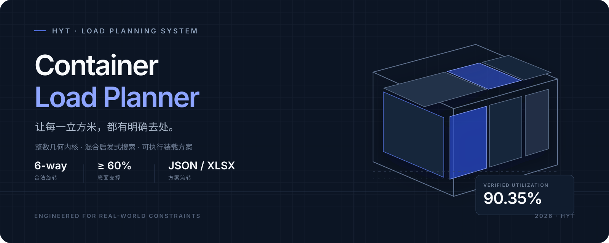
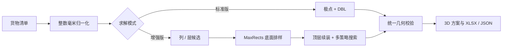

<p align="center">
  
</p>

<p align="center">
  面向真实装柜约束的三维装箱系统。把货物清单转化为可执行、可复核、可导出的装载方案。
</p>

<p align="center">
  <a href="https://loader-hyt.streamlit.app/"><strong>打开在线工作台 →</strong></a>
  &nbsp;&nbsp;·&nbsp;&nbsp;
  <a href="#本地运行">本地运行</a>
  &nbsp;&nbsp;·&nbsp;&nbsp;
  <a href="#算法与约束">算法说明</a>
</p>

---

## 产品概览

HYT Container Load Planner 接收集装箱尺寸与货物清单，计算每件货物的摆放位置和朝向，并在同一工作台内完成数据录入、实时预估、三维复核与方案交付。

<p align="center">
  
</p>

| 计算 | 复核 | 交付 |
| :--- | :--- | :--- |
| 标准版快速生成稳定方案；增强版通过列/层生成、MaxRects 与多策略搜索持续改进 | 整数毫米几何内核逐件校验边界、碰撞、朝向与支撑 | Excel / JSON 双格式导出；保存的方案可重新导入网站查看 |

## 为什么是它

- **以装入件数为第一目标**：先尽可能装完，再比较空间利用率与底层偏好。
- **增强版不劣于标准版**：标准版结果始终作为精英下界，新候选只有更优时才会替换。
- **为真实操作设计**：支持六向旋转、禁止倒放、重货/密度底层优先以及至少 60% 的底面支撑。
- **计算结果可解释**：三维视图支持类别高亮、透明模式和长/宽/高分段查看。
- **输入输出闭环**：网页表格、TXT、XLSX 均可作为清单入口；方案可导出为 XLSX 或 JSON 后再次载入。

## 算法与约束



所有候选最终都经过同一套硬约束内核：

1. **边界**：货物六个面均不得超出集装箱内尺寸。
2. **碰撞**：任意两件货物的三维实体不得相交。
3. **支撑**：非落地货物至少 60% 的底面积由下方货物直接支撑。
4. **朝向**：普通货物可尝试六种正交旋转；禁止倒放货物只允许绕竖直轴旋转。

重量与密度属于底层摆放的软偏好，不会作为硬约束牺牲可装件数。

### 客户清单回归

| 数据规模 | 原增强算法 | 当前增强算法 | 体积利用率 | 求解时间* |
| ---: | ---: | ---: | ---: | ---: |
| 435 件 / 5 类 | 424 / 435 | **435 / 435** | **90.35%** | **约 1.4 秒** |

<sub>* 开发机回归结果。实际时间受硬件、清单结构和搜索上限影响；找到全装方案后会立即停止。</sub>

## 本地运行

要求 Python 3.9 或更高版本。

```bash
git clone https://github.com/hyt0019/loader.git
cd loader
pip install -r requirements_web.txt
streamlit run app.py
```

浏览器将打开 `http://localhost:8501`。Windows 可直接运行 `run_web_app.bat`，macOS 可运行 `run_web_app.command`。

## 使用流程


### 清单格式

TXT 文件使用以下结构，尺寸单位为米：

```text
5.8 2.35 2.35
2
0.49 0.40 0.09 44 18 1
1.20 1.00 1.35 7 1472 0
```

第一行为集装箱长、宽、高；第二行为货物种类数；后续每行依次为长、宽、高、数量、重量、类型。类型 `0 / 1 / 2` 分别表示木箱、纸箱和托盘。网页也支持直接编辑表格或导入网站导出的 XLSX。

## 系统结构

```text
app.py                    Streamlit 工作台、Plotly 三维视图、导入导出
packer_pro.py             整数几何内核、标准与增强求解器
tests/                    算法与方案导入回归测试
.streamlit/config.toml    网页主题和部署配置
sample_data.txt           可直接导入的示例清单
requirements*.txt         本地与云端运行依赖
```

网页端调用 `packer_pro.py` 中的同一套求解与校验逻辑；桌面命令行也可直接运行该文件。

## 部署

Streamlit Community Cloud 可直接从 GitHub 部署：选择本仓库和目标分支，入口文件填写 `app.py`。代码推送后，Cloud 会自动同步并重新运行应用。

## License

基于 [MIT License](LICENSE) 发布。

<p align="center">
  <sub>Designed &amp; engineered by HYT · Container Load Planner</sub>
</p>
